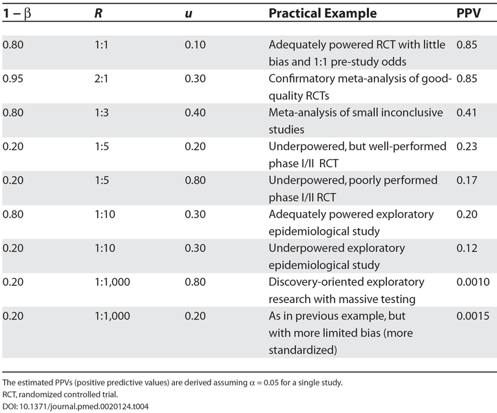
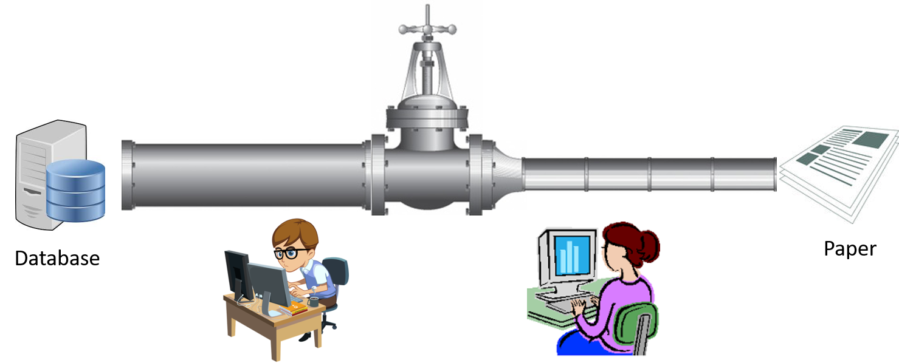

# The OHDSI Community{#ohdsiCommunity}

<div style="text-align: right"> *Seng Chan You* </div>
<div style="text-align: right"> *Last update: 2019-06-06* </div>

## OHDSI 홈페이지

[국제 OHDSI 네트워크 공식 홈페이지](https://www.ohdsi.org/)를 참고하기 바란다. [한국 OHDSI 네트워크 홈페이지 ](https://www.ohdsi-korea.org/)도 곧 오픈 예정이다.

## 분산연구망과 공통데이터모델{#drnCdm}

### 분산연구망 (Distributed Research Network)
의료 데이터는 데이터 구조, 형식의 이질성, 데이터의 질과 양 등 기술적인 어려움과 기관의 허락, 개인정보보호문제 등 법적 문제 그리고 타인에게 제공하는 데이터가 자신에게 불리하게 사용될지 모른다는 두려움 등 자신의 자료를 타인과 공유하고 싶지 않는 문제들이 있어 공유가 쉽지 않았다. 현재까지 대부분의 기관간 공동 연구는 극히 일부의 환자 데이터를 연구 주도 기관과 공유함으로써 진행하였는데, 한 번의 공동 연구를 위해 막대한 노력과 시간, 자금이 들어가는 현실적인 문제와 개인 정보의 공유라는 윤리적인 문제들이 있어 왔다.

이런 제약을 극복하는 방법 중 하나가 분산연구망이다. 이는 의료데이터 유통의 제약 요인 극복을 위해 병원과 기업 등 수요자 간에 원본데이터의 공유 없이 분산된 형태로 데이터를 관리하면서 기관 내에서 분석한 결과만 필요 할 때 거래하는 방식이다.

쉽게 설명하면, 각 병원의 환자정보를 표준화 및 익명화한 후 데이터를 병원 폐쇄망 안에 두고 사용자의 요청에 따라서 기관 안에서 분석코드/프로그램을 실행해 분석된 요약 집합정보(평균, 합, 표준편차, 오즈비, 위험도 등)만 수요자에게 회신하는 방식이라고 할 수 있다. 수요자는 폐쇄망 안에 있는 환자의 개별 정보를 보거나 취득할 수 없지만, 전체 데이터를 모아서 분석한 것과 동일한 분석 결과를 도출할 수 있다. 여러 기관에서 자료를 통합하기 위해서는 공통데이터모델이 적용되어야 한다.

### 공통데이터모델 (Common Data Model)
앞서 설명했듯이 데이터 표준화는 연구자들이 연구에 사용할 데이터를 공통 형식으로 저장하여 협업 연구, 대규모 분석 및 정교한 도구 및 방법론 공유를 가능하게 하는 중요한 프로세스이다. 하지만 표준화 작업을 하기 위해서는 오랜 시간과 비용이 소요된다.

이런 문제를 해결하기 위해 등장한 것이 공통데이터모델이다. 이는 여러 병원들의 데이터를 효율적으로 활용하기 위하여 정의한 표준화된 데이터 구조이다. 다기관 공동 연구 수행 시에 기관별로 서로 다른 데이터 구조로 인해 다양한 어려움이 따르는 것을 해결해 주는 방식으로 기관별로 상이한 데이터 구조와 의미를 동일한 하나의 구조와 의미를 갖도록 변환하는 벙법이라고 이해하면 쉽다.

공통데이터모델을 따르기 위해서는 각 병원이나 기관이 기존의 데이터를 공통데이터모델로 변환하는 과정이 필요하다. 이를 ETL(Extract, Transform, Load) 이라 한다. 공통데이터모델은 기존의 한계점 등을 고려하여 지속적으로 업데이트 되고 있는 중이다.

```{r DRN, fig.cap='Distributed Research Network',echo=FALSE, out.width='75%'}
knitr::include_graphics("images/OhdsiCommunity/CDM_DRN_1.png")
```

대표적인 공통데이터모델로는 비영리 국제컨소시엄인 오딧세이(Observational Health Data and Informatics, 이하 OHDSI)와 약물부작용 조사를 위한 미국 FDA의 센티넬 공통데이터모델(이하 Sentinel CDM), 미국 국내에서의 비교효과연구를 위한 피코르넷(The National Patient-Centered Clinical Outcomes Research Network, 이하 PCORnet) 등이 존재한다.

이중 대표적인 공통데이터모델인 OHDSI를 살펴보자. OHDSI는 2008년에 미국정부의 지원으로 결성된 Observational Medical Outcomes Partnership(OMOP)으로부터 파생된 국제적 협의체이다. 초기에는 관찰연구 방법론과 데이터를 활용하기 위한 분석 도구 및 시각화 도구, 그리고, 각 기관마다 다른 진단, 처방 용어를 통일한 표준용어를 만들었다.

OMOP은 2013년 정부의 지원이 예정대로 종료된 후, OMOP CDM과 표준 용어 정의 등 OHDSI로 이관되어 계속되고 있다. 특히 OMOP시절에는 약물부작용 조사 방법론에 초점을 맞추었지만, 이후 OHDSI로 이관한 이후에는 약물의 안전성, 비교효과연구, 경제성 분석, 의료의 질, 인공지능 기반의 환자 개별 위험도 예측 등 임상 빅데이터 분석으로 진화해 나가고 있다.

또 다른 CDM인 Sentinel Initiative는 미국 식품의약국(Food and Drug Administration, 이하 FDA)로부터 시작되었다. 의료 제품의 안전성 감시를 위한 국가적 전자시스템으로 Sentinel 시스템을 개발하였다. 이 시스템은 FDA 규제 제품을 사용하여 보고된 이상 반응을 추적하는 기존의 감시 기능을 보완하여 FDA가 이러한 제품의 안전성을 사전에 평가할 수 있도록 한다.

Sentinel은 데이터 파트너가 기존 환경에서 전자 데이터에 대한 물리적 및 운영상의 제어를 유지하는 분산 데이터 접근 방식을 사용한다. 분산된 접근 방식은 Sentinel CDM으로 저장된다. 참여하는 데이터 파트너는 자신들이 보유한 데이터를 통일된 Sentinel CDM으로 변환하므로 하나의 동일한 분석 프로그램으로 여러 기관 결과를 동시에 분석할 수 있다. 개인정보보호를 위하여 분석 쿼리가 배포되고 검색 결과가 보안 포털을 통해 반환된다. 모든 데이터 파트너들 사이에서 합쳐진 데이터 집합을 Sentinel Distributed Database(SDD)라고 한다.

또 다른 CDM인 PCORnet은 The Patient-Centered Outcomes Research Institute(PCORI)에서 2013년에 설립한 프로젝트로서 환자 전자건강기록(Electronic health records, EHR)을 이용하여 비교효과연구(Comparative effectiveness research, CER)를 수행하기 위한 목적으로 시작되었다. 50개 주에 걸쳐 11개의 임상 데이터 연구 네트워크(Clinical data research networks, CDRNs)와 18개의 환자 참여 연구 네트워크(Patient-powered research networks, PPRNs)를 설립했다. PCORnet이 구축하고 있는 연구 플랫폼의 핵심은 환자 중심의 접근 방식(patient-centered approach)이며 데이터는 중추 역할을 한다.


## 오딧세이 네트워크 (OHDSI network) {#OHDSINetwork}
오딧세이 네트워크 (The Observational Health Data Sciences and Informatics, OHDSI network)는 의약품의 적절한 사용에 대한 관찰 연구의 증진을 위해 시작된 OMOP (Observational Medical Outcomes Partnership) 프로젝트를 전신으로 하여 만들어진 국제 컨소시엄이다. 공통데이터모델 (CDM) 및 분산연구망 (Distributed Research Network)을 채택한 연구 네트워크 중 아시아, 미국 및 유럽 등 국제적 참여 및 활동이 이루어 지고 있는 컨소시엄은 OHDSI가 유일하다. OHDSI 네트워크에서는 OMOP-CDM을 채택하여, 이를 발전시켜 나가고 있으며 국제적 연구자들의 적극적인 참여, 협력 및 토론과 함께 데이터 시각화, 분석 등의 소프트웨어를 개발 및 제공하고 있다.

## OHDSI의 역사 {#OHDSIHistory}

2008년 미국 식약처 (FDA) 주도로 공공기관과 여러 제약회사, 의료기관을 포함하는 민간기관, 학계가 합동하여 후향적 보건 데이터베이스의 적절한 활용을 통해 의약품의 효과 및 안정성을 확인하기 위한 파트너십으로 OMOP (Observational Medical Outcomes Partnership) 프로젝트가 시작되었다 [ref](https://fnih.org/what-we-do/major-completed-programs/omop). 2009년 [OMOP-CDM version 1](http://forums.ohdsi.org/uploads/default/original/1X/7b3fb0f7acda70533b966d2834fef4ded62a97be.docx)이 탄생하였다 [ref](http://forums.ohdsi.org/t/is-omop-cdm-10-years-old-in-2017/3370/4). OMOP은 common data model (CDM) 인프라 기반으로 청구 데이터 (claim data) 및 전자 의무 기록 (eletronic heatlh record) 를 통합하고 대규모 통계 분석의 가능성 및 유용성을 확인하였고, 2013년 Reagan-Udall 재단으로 이전되었다. 
FDA의 재정 지원이 중단된 후 OMOP은 해체되었지만,  Columbia 대학을 조직 본부 (coordinating center), George Hripsack 교수를 의장으로 하여 프로젝트에 참여했던 사람들은 다시 오픈 사이언스를 지향하는 비영리 연구 네트워크 오딧세이 (OHDSI) 를 구성하였다. 원래는 긴 여정을 뜻하는 ODYSSEY로 이름을 짓고 싶었지만, 너무 많은 단체에서 사용하고 있는 이름이어서 사전의 영문 발음기호를 따라 OHDSI라고 지었다는 후문이 전해진다. 
2014년 뉴욕 Columbia 대학에서 Face-to-Face 모임 (F2F meeting)을 가진 후 2015년 워싱턴 (Washington DC)에서 첫번째 연례 심포지엄을 가졌다. 이후 매년 워싱턴 또는 베데스타 (Bethesda) 에서 가을에 연례 심포지엄을 열고 있다. OHDSI의 가치에 따라 연례 심포지엄은 무료로 진행이 되고 있다. 

### 한국 오딧세이의 역사 {#OHDSIKoreaHistory}
아주대학교 박래웅 교수가 아주대 병원의 전자의무기록을 이용하여 2014년 OMOP-CDM 도입을 시작하였고, 2015년 첫 연례 심포지엄에서 활용 결과를 발표하면서 한국의 OHDSI 참여가 시작되었다. 이후 계속적으로 한국에서 OMOP-CDM, OHDSI 전파를 위해 노력하였고, 2016년부터는 최초로 국제 OHDSI committee에서 개별 국가를 위한 포럼 [Korean chapter](http://forums.ohdsi.org/c/For-collaborators-wishing-to-communicate-in-Korean)을 개설하고, 한국의 OHDSI 참여를 독려하였다.
첫 한국 국제 오딧세이 심포지엄은 2017년 3월 아주대학교에서 튜토리얼, 리더십 미팅을 포함하여 3일간 개최되었다.

```{r OHDSIInternationalSymposium2017inKorea1, fig.cap='OHDSI International Symposium 2017 in Korea',echo=FALSE, out.width='80%'}
knitr::include_graphics("images/OhdsiCommunity/DSC01956.jpg")
knitr::include_graphics("images/OhdsiCommunity/DSC01861.jpg")
```

```{r OHDSIInternationalSymposium2017inKorea2, fig.cap='Tutorial in the OHDSI International Symposium 2017',echo=FALSE, out.width='80%'}
knitr::include_graphics("images/OhdsiCommunity/DSC02166.jpg")
```
한국 OHDSI 네트워크에 참여를 희망하는 병원 관계자들과 함께 2017년 3월 7일 첫번째 리더십 미팅을 가진 후 현재까지 2달마다 전국의 의과대학/병원을 순회하며 한국 OHDSI 리더십 미팅을 개최하며 OHDSI 전파 및 상호 협력을 꾀하고 있다.


## 미션, 비젼, 가치 {#MissionVissionValues}

[OHDSI 공식 홈페이지의 mission, vision, value page](https://www.ohdsi.org/who-we-are/mission-vision-values/)에서 확인할 수 있다.

### OHDSI 미션

참여 공동체의 상호협력 하에 의료 발전을 촉진하는 증거를 생성하는 능력을 부여한다.

> To improve health by empowering a community to collaboratively generate the evidence that promotes better health decisions and better care.


### OHDSI 비전

의료 빅데이터의 분석을 통해 세계에 건강과 질병에 대한 포괄적인 이해를 제공한다.

> A world in which observational research produces a comprehensive understanding of health and disease.

### OHDSI 핵심 가치

* **혁신성 Innovation**: 우리는 적극적으로 의료 빅데이터 분석 및 연구에 대한 혁신적인 방법론과 접근법을 찾고 격려한다.

> Observational research is a field which will benefit greatly from disruptive thinking. We actively seek and encourage fresh methodological approaches in our work.

* **재현성 Reproducibility**: 우리는 보건 증진을 위하여 정확하고, 재현 가능하며, 잘 보정된 증거를 찾도록 노력한다.

> Accurate, reproducible, and well-calibrated evidence is necessary for health improvement.

* **공동체 정신 Community**: 우리는 모든 참여자들을 환영하며 동등하게 우리의 활동에 참여할 수 있도록 돕는다.

> Everyone is welcome to actively participate in OHDSI, whether you are a patient, a health professional, a researcher, or someone who simply believes in our cause.

* **개방성 Openness**: 우리는 의사 결정 과정의 투명성을 지향하며, 우리의 진보 및 우리가 생성한 방법론, 소프트웨어, 증거를 가능한 공개적으로 접근 가능하게 한다.

> We strive to make all our community’s proceeds open and publicly accessible, including the methods, tools and the evidence that we generate.

* **협력 정신 Collaboration**: 우리는 참여자들의 실제적 요구를 우선적으로 다루고, 그것을 위해 공동으로 노력한다.

> We work collectively to prioritize and address the real world needs of our community’s participants.

* **선행의 정신 Beneficence**: 우리는 고통 받는 환자를 비롯하여 참여자 및 참여기관의 권리를 보호하기 위해 노력한다.

> We seek to protect the rights of individuals and organizations within our community at all times.

OHDSI의 핵심 가치를 요약해 보면, '개방적인 커뮤니티에서 함께 혁신적이고, 재현 가능한 연구를 통해 선행의 정신을 구현하자' 정도로 요약해볼 수 있겠다. 

## 재현 가능한 연구 (Open Science and Reproducible Research){openScience}

OHDSI하면 전세계적에 통용 가능한 CDM 기반의 DRN 시스템이 가장 큰 특징으로 꼽히겠지만, 그 못지 않게 중요한 특징은 개방성과 재현성을 추구한다는 데에 있다. 

### 연구 재현성의 위기 (Reproducibility Crisis)

2016년 Nature지에서 1576명을 대상으로 설문조사를 진행하였을 때, 70% 이상의 연구자들이 다른 사람의 실험을 재현하는 데 실패하였으며, 약 50%에서 자신의 실험을 재현하는 데 실패했다고 밝혔다. 52%의 연구자들은 현재 과학계에 중대한 재현성의 위기가 존재한다고 시인했다. [ref](https://www.nature.com/news/1-500-scientists-lift-the-lid-on-reproducibility-1.19970)

```{r isThereAReproducibilityCrisis, fig.cap='연구 재현성의 위기는 실존하는가?',echo=FALSE, out.width='80%'}
knitr::include_graphics("images/OhdsiCommunity/reproducibility-graphic-online1.jpeg")
```


의료 데이터를 이용한 재현 가능한 연구 (Reproducible research)를 아주 간단히 정의하자면 '원 자료 (raw data)로부터 같은 결과를 도출하는 데이터 분석'이라고 할 수 있다. 

유전자 데이터 및 의료 의무기록 등의 급증과 더불어 부상하고 있는 의료계의 빅데이터 분석 흐름에, 많은 연구들이 거짓 증거들을 만들고 있는 것이 아닌가하는 우려가 뒤따르고 있다. 실제로 PLOS Medicine에 실린 논문에 따르면 연구 대상자 수가 충분치 않은 역학 연구의 경우 1/10 경우만이 믿을 수 있고, 논문을 위한 논문 (Discovery-oriented exploratory research with massive testing)의 경우 1000개 중 1개 만이 믿을만 하다고 한다 [ref, *Ioannidis, 2005 PLOS Medicine*].

```{r whyMostPublishedResarchFindingsAreFalse, fig.cap='PPV of Research Findings for various combinations of power, ratio of Tru to Not-True Relationship, and Bias',echo=FALSE, out.width='80%'}

```

어째서 이러한 일이 벌어지고 있는 것일까? 연구 재현성을 가로막는 것으로는 다음의 4가지가 주요 요인으로 꼽힌다[ref, *Bishop, 2019, Nature*].

* 출판 편향 Publication Bias
* 충분치 않은 연구 대상자 수 또는 낮은 위험도 비 Low Statistical Power
* *P* 값 해킹 *P*-value Hacking
* 결과를 알고 난 후 가설 재 수립 HARKing (Hypothesizing After Results are Known)

#### 출판 편향 Publication Bias

*많은 관심을 받는 선택 편향의 또 다른 버전은 출퍈 편향이다. 출판 편향이란 어떤 현상을 보여주는 데 실패했다는 논문보다 성공했다는 논문을 과학 저널이 더 선호하는 경향이 있다는 것이다. 이 경향은 '서류함 효과 (file drawer effect)로도 불린다. 이 명칭은, 일부 연구 결과는 논문으로 완성되어 과학 저널에 실리지 못하고 끝내 서류함 속에 머문다는 뜻을 담고 있다.*
[ref, 데이비드 핸드, 신은 주사위 놀이를 하지 않는다. 165쪽]

출판 편향은 p-value hacking 및 HARKing을 일으키는 근본 원인이 된다. 현재 한국 연구 사회는 논문의 impact factor (IF) 를 이용하여 연구자의 자질을 평가하고, 줄을 세우고 있기 때문에 세상에 기여를 하는 연구보다는 높은 IF의 논문이 연구자들의 주요 목적이 되고 있다. 

#### 충분치 않은 연구 대상자 수 또는 낮은 위험도 비 Low Statistical Power

연구의 대상 샘플 크기가 적거나 (small sample size) 효과의 크기가 적은 경우 (small effect), 위양성의 결과가 나올 가능성이 높다. 충분한 수를 갖지 못한 (underpowered) 연구를 지속하는 원동력은 원하는 결과가 나오길 바라는 맹목적인 바람뿐이고, 이는 낭비나 다름 없다는 [ref, R. G. Newcombe Br. Med. J. (Clin. Res. Ed.) 295, 656–659; 1987] 주장도 있다. Low Statistical Power를 지닌 연구를 진행하면서, 출판 편향을 극복하기 위해 통계적으로 유의미한 결과를 내기 위해 결국 *p*-value hacking과 HARKing이 사용될 수밖에 없다. 하지만 이는 결국 맹목적으로 IF 성과를 요구하는 연구 사회의 태도와 이러한 결과를 인정해주는 연구 풍토에서 기인한다고 볼 수 있다. 

#### *P* 값 해킹과 결과를 알고 난 후 가설 재 수립 *P*-value Hacking and HARKing (Hypothesizing After Results are Known)

*P*-value hacking 및 HARKing 은 많은 연구자에게 만연하게 나타나고 있는 현상으로, 'Discovery-oriented exploratory research with massive testing'이라고도 부를 수 있다. 높은 IF의 저널에 출판하기 위하여 통계학적으로 유의한 결과가 중요해짐에 따라, 연구자들은 어떤 방식으로든 통계학적으로 유의미한 *P*-value (*P* < 0.05) 를 만들어내는 경향이 있고, 데이터 수집 및 분석을 다양히 시도해봄으로써 어떠한 결과도 만들어 낼 수 있다. 'False-Positive Psychology' 제목의 논문에서 Simmons 등은 4가지의 자유도 (변수, 샘플 크기, 공변량 사용, 보고하고 싶은 결과)를 자유롭게 선택할 수 있다면 '비틀즈의 노래를 듣고 나면 나이가 어려진다' 라는 황당한 결론을 만들어내는 것도 가능하다는 것을 입증했다 [ref, Simmons et al., 2011 Psychological Science]. [Hack Your Ways To Scientific Glory](https://projects.fivethirtyeight.com/p-hacking/) 사이트는 *P*-hacking 시뮬레이션을 제공하는데, 실제 여러변 testing을 거치며 0.05 미만의 *P* 값을 찾아내는 우리의 현실과 매우 유사하다. 

### 재현가능한 연구를 위하여

Simmons 등은 앞선 연구에서 연구의 위양성을 줄이기 위하여 하기와 같이, 6가지의 공개 중심 방안 (disclosure based solution)을 소개했다. 간단히 정리 하자면 데이터를 투명하게 수집하고, 충분한 샘플 크기를 가지고, 사용하는 변수와 방법, 그리고 결과를 모두 공개하라는 것이다. 
```
1. Authors must decide the rules for the terminating data collection before data collectino begins and report this rules in the article
2. Authors must collect at least 20 observations per cell or else provide a compelling cost-of-data collection justification
3. Authors must list all variables collected in a study
4. Authors must report all experimental conditions, including failed manipulations
5. If observation are elimiated, authors must also report what the statistical results are if those observations are included
6. If an analysis includes a covariate, authors must report the statistical results of the analysis without the covariate. 
```
강제는 아니지만 연구 재현성을 위한 OHDSI 연구의 기본 철학은 '파이프라인과 같은 연구' 이다. 데이터베이스로부터 결과 도출까지의 전 과정을 자동화하는 것을 목표로 하고 있다. OHDSI에서 연구를 수행한다는 것은 결국 이러한 파이프라인을 만드는 작업이 된다. 이러한 정신에 입각하여 연구에 사용된 코드를 [OHDSI Studies GitHub](https://github.com/OHDSI/OhdsiStudies) 또는 [OHDSI Study Protocol Github](https://github.com/OHDSI/StudyProtocols)을 통해 모두 공개하며 [연구 결과](http://data.ohdsi.org/) 역시 공개하고 있다. 

```{r ohdsiStudyShouldBeLookLikeAPipeline, fig.cap='An OHDSI study shoul be look like a pipeline',echo=FALSE, out.width='80%'}

```
