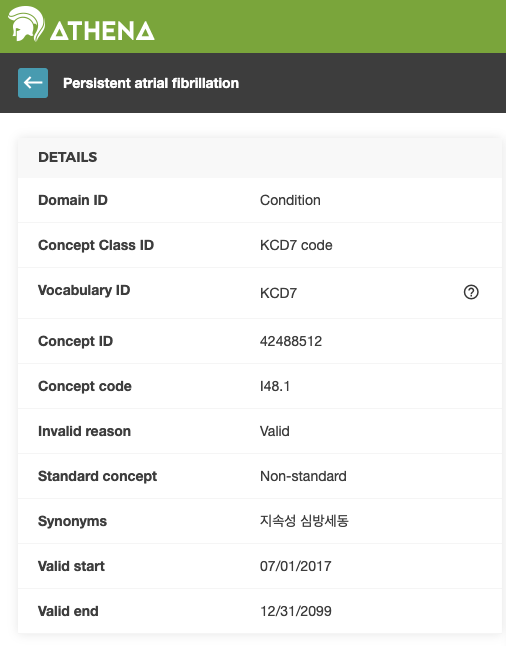
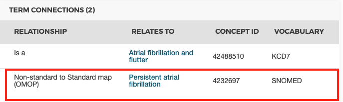

# (PART) 공통 데이터 모델 {-}

# 공통 데이터 모델 {#CommonDataModel}

*Chapter leads: Clair Blacketer*

관찰 데이터는 환자가 진료를 받는 동안 어떤 일이 일어나는지를 보여준다. 전 세계적으로 점점 더 많은 수의 환자에 대한 데이터가 빅 데이터라고 불리는 형태로 수집 및 저장되고 있다. 이러한 데이터의 일차적 목적은 다음과 같은 세 가지로 설명할 수 있다. (i) 직접적으로 (많은 경우에 설문 조사 및 레지스트리 정보를 활용하여) 연구를 용이하게 하기 위해, (ii) 의료 행위 수행을 지원하기 위해 (이를 보통 전자 의무 기록 Electronic Health Records(EHR)이라고 함), 또는 (iii) 의료비 지불 관리를 위함(청구 데이터). 세 가지 목적 모두 임상 연구에 보편적으로 사용되나, 두, 세 번째 항목은 이차적인 목적으로 사용된다. 위 세 가지 모두 일반적으로 고유한 내용의 형식 및 인코딩으로 이루어져 있다. \index{Common Data Model} \index{CDM |see {Common Data Model}} \index{relational data model|see {Common Data Model}}

관찰형 의료 데이터 Observational healthcare data에 공통 데이터 모델이 필요한 이유는 무엇일까?

일차적인 목적에 의해 모든 임상적인 사건을 동일하게 포착하는 관찰형 데이터베이스 Observational database는 없다. 따라서, 여러 다른 데이터 출처에서 연구 결과를 도출하고 데이터를 포착하는 과정에서 발생하는 잠재적 비뚤림 bias의 영향을 이해하기 위해 결과들을 비교 및 대조해야 한다. 또한 통계적 검증력을 갖춘 결론을 도출하려면 많은 수의 환자가 필요하다. 이는 여러 데이터 출처를 동시에 평가하고 분석해야 할 필요성을 설명한다. 그러기 위해서는 데이터를 공통 데이터 표준 common data standard으로 변환할 필요가 있다. 게다가 환자 데이터는 민감 정보이기에 높은 수준의 보안이 필수적이다. 기존에 그래왔듯이 분석을 목적으로 하는 데이터 추출은 엄격한 데이터 사용 계약 및 복잡한 접근 제어 방식이 필요하다. 공통 데이터 표준은 연구자의 분석환경으로 데이터를 추출하지 않고, 연구자가 만든 분석 프로세스를 데이터가 있는 곳으로 전달하는 방식으로 작동할 수 있어, 데이터 추출 단계를 생략하고 기본 환경의 데이터에 대해 표준화된 분석을 실행할 수 있도록 하여 개인 정보 유출 위험 및 추가 보안의 필요성을 줄여 줄 수 있다.

이러한 표준은 공통 데이터 모델 Common Data Model(CDM)에 의해 제공된다. CDM은 표준화된 데이터를 기반으로 (\@ref(StandardizedVocabularies)장 참조) 연구 방법들을 효과적으로 비교할 수 있고, 재현 가능한 결과를 얻을 수 있는 체계적인 환경을 제공한다. 이 장에서는 데이터 모델 아키텍처를 비롯하여 CDM 디자인, 규칙 및 테이블 선택에 대한 논의를 제공하고자 한다.

CDM 내의 모든 테이블에 대한 개요는 그림 \@ref(fig:cdmDiagram) \index{Common Data Model!data model diagram}에서 살펴볼 수 있다.

<div class="figure">

<p class="caption">(\#fig:cdmDiagram)CDM 6.0 버전의 모든 테이블에 대한 개요. 테이블 간의 모든 관계가 표시된 것은 아님.</p>
</div>
## 설계 원리

OMOP CDM은 다음과 같은 목적의 전형적인 관찰 연구에 최적화되어 있다.\index{Common Data Model!design principles}

*	특정한 의료 행위의 개입(약물 노출, 시술 procedure, 의료 정책 변경 등)이 있거나 의료 관련 결과(질환, 시술, 기타 약물 노출에 대한)를 포함하는 환자 집단 확인.
*	인구 통계학적 정보, 질병의 자연사, 의료 서비스 전달, 활용 및 비용, 병적 상태, 치료 및 치료 과정 등과 같은 다양한 매개 변수에 대한 환자 집단의 특성 확인.
*	개별 환자에서 결과의 발생 예측 - \@ref(PatientLevelPrediction)장 참고,
*	앞서 설명한 의료 행위의 개입이 인구 수준에 미치는 영향 추정 - \@ref(PopulationLevelEstimation)장 참고,


이러한 목표를 달성하기 위해서 OMOP CDM의 개발은 다음과 같은 설계 요소를 따른다:


  - **목적에 대한 적합성**: CDM은 의료 서비스 제공이나 보험청구 업무를 해결하기 위한 목적보다는 데이터 분석 연구에 최적화된 방식으로 구성된 데이터를 제공하는 것을 목표로 한다.\index{Common Data Model!suitability for purpose}
  - **데이터 보호**: 이름, 일 단위의 생년월일 등 환자의 신원 및 안전을 위협할 수 있는 모든 데이터는 제한되어 있다. 영아에 대한 연구를 위한 정확한 생년 월일과 같은 보다 자세한 정보가 명시적으로 필요한 경우에는 예외가 가능하다.\index{Common Data Model!data protection}
  - **도메인 설계**: 도메인은 사람 중심 관계형 데이터 모델 person-centric relational data model로 모델링 되며 기록마다 개인의 신원과 날짜 정보가 최소한으로 수집된다. 여기서 관계형 데이터 모델은 데이터가 기본 키 primary key와 외래 키 foreign key로 연결된 테이블로 표현되는 모델이다.
  - **도메인의 이론적 근거**: 개체-관계 모델 entity-relationship model에서 도메인은 분석 이용 사례가 있는지 (예를 들면, 질환 conditions) 그리고 달리 적용 가능한 방안이 없는 특정한 속성attributes이 있는지에 따라서 별도로 정의된다. 다른 모든 데이터는 개체-속성-값 구조 entity-attribute-value structure를 가진 Observation 테이블에 관찰 데이터로 저장할 수 있다.\index{Common Data Model!domains}
  - **표준화된 용어**: 기록을 표준화하기 위해, CDM은 필수적이고 적절한 표준 건강 관리 개념 concept 을 포함하는 표준 용어에 의존한다. (역자 주: OMOP 표준 용어 및 개념은 OMOP-CDM의 가장 큰 특장점이다. 표준 용어집은 일종의 사전이며, concept 은 OMOP CDM의 하나하나의 단어/어휘로 생각할 수 있다. 'Concept'을 우리 말로 번역하면 '개념' 이지만, 문맥에 따라 이해하기 어려운 경우 concept 영문을 그대로 사용한다.)
  - **기존 용어 재사용**: 이러한 concept은 국립 의학 도서관 NLM, 재향 군인 담당 부서 Department of Veteran's Affair, 질병 예방센터 CDC 등과 같은 국가 및 산업 표준화 또는 용어 정의 주도 기관이나 협회에서 만든 용어를 재사용하기도 한다.
  - **원본 코드 유지 관리**: 모든 의료 코드가 표준화된 용어에 매핑되어 있더라도 정보가 소실되지 않도록 원본 코드도 저장한다.\index{Common Data Model!Source Codes} \index{Common Data Model!data loss prevention}
  - **기술 중립성**: CDM은 특정 기술만을 채택하지 않는다. Oracle, SQL Server 등과 같은 관계형 데이터베이스 또는 SAS 분석 데이터 세트로도 구현될 수 있다.\index{Common Data Model!technology neutrality}
  - **확장성**: CDM은 데이터 처리 및 컴퓨터를 이용한 분석에 최적화되어 있기 때문에 수십억 건에 달하는 임상 관찰을 비롯하여 수억 명이 포함된 데이터베이스 등 다양한 크기의 원천 데이터를 수용할 수 있다.\index{Common Data Model!scalability}
  - **이전 버전과의 호환성**: 이전 CDM으로부터의 모든 변경 사항은 Github 저장소 [(https://github.com/OHDSI/CommonDataModel)](https://github.com/OHDSI/CommonDataModel)에 명확하게 서술되어 있다. 버전이 업데이트 되어도, 이전 버전의 CDM은 최신 버전을 이용해 쉽게 만들 수 있으며, 이전 버전에 존재하던 정보는 손실되지 않는다.\index{Common Data Model!backwards compatibility}

## 데이터 모델 규칙

CDM에 채택된 많은 묵시적 혹은 명시적인 규칙이 있다. 따라서, CDM에 관련된 메소드 개발자는 이러한 규칙을 잘 이해하고 있어야 한다. \index{Common Data Model!conventions}

### 모델의 일반적인 규칙{#model-Conv}
mn
CDM은 “사람 중심”의 모델로서, 모든 임상적인 사건에 대한 테이블이 PERSON 테이블을 중심으로 연결되어 있다. 시작 날짜 및 기타 날짜 정보와 더불어 이는 모든 의료 관련 사건에 대해 사람별로 종적 관찰이 가능하도록 한다. 이 규칙에 예외적으로, 표준화된 의료체계 데이터 테이블들 standardized health system data tables은 다양한 도메인의 사건에 직접 연결되어 있다.

### 스키마의 일반적인 규칙

데이터베이스 관리자는 스키마 또는 데이터베이스 별로 읽기 용 테이블과 읽기/쓰기 테이블을 분리할 수 있다. 임상 사건 및 용어 테이블은 “CDM” 스키마에 저장하며, 이를 사용자 end user에게 읽기 전용으로 셋팅하는 것을 추천한다. ATLAS 및 사용자가 조작할 필요가 있는 테이블은 “Result” 스키마에 저장하여 "CDM" 데이터가 저장되는 데이터베이스와 분석시마다 중간 결과 등이 저장되는 "Result" 스키마 또는 데이터베이스를 분리하는 것이 좋다. "Result" 스키마에 들어가는 두 테이블은 COHORT와 COHORT_DEFINITON이다. 이 테이블은 \@ref(Cohorts)장에 자세히 설명된 것처럼 사용자가 정의할 수 있는 관심 그룹 또는 코호트에 대한 정보 및 설명을 저장하기 위한 테이블들이다. 이는 분석 중에 테이블이 작성될 수 있음을, 즉 사용자별로, 분석별로 개별 테이블을 생성하여 정보를 저장할 수 있음을 의미한다. 읽기-쓰기가 가능한 스키마를 하나로만 설정함으로써, 다수의 사용자들의 이용을 운영 및 제어하는 것은 그에 맞춘 CDM의 구현에 달려 있다.

### 데이터 테이블의 일반적인 규칙

CDM은 데이터 베이스 플랫폼에 독립적이다. 데이터 유형은 일반적으로 ANSI SQL 데이터 유형 (VARCHAR, INTEGER, FLOAT, DATE, DATETIME, CLOB)을 사용하여 정의된다. VARCHAR에서만 (문자열 길이와 같은) 추가적인 정밀도가 필요하다. 이는 필요한 최소 문자열 길이를 반영하지만, 구체적인 CDM 인스턴스 내에서 확장할 수 있다. CDM은 날짜 및 날짜 시간 형식을 규정하지 않는다. CDM에 대한 표준 쿼리는 로컬 인스턴스 및 날짜/시간 구성에 따라 달라질 수 있다.

*참고*: 데이터 모델 자체는 플랫폼에 독립적이지만, 데이터 모델과 함께 작동하도록 구축된 여러 도구는 특정 사양이 요구된다. 이에 대한 자세한 내용은 \@ref(OhdsiAnalyticsTools)장 참조.

### 도메인의 일반적인 규칙{#domains}

서로 다른 성격의 기록은 도메인 domain 별로 정리되어 있다. 이러한 기록은 도메인별로 테이블과 필드에 저장되고, 표준화된 용어에 정의된 대로 도메인별 표준 개념 standard concept으로 표현된다 (\@ref(conceptDomains)절 참조). 각 표준 개념에 고유한 도메인이 할당되는데, 이는 어떤 테이블에 기록되어야 하는지를 정의한다. 정확한 도메인 할당은 커뮤니티 내에서 항상 논의의 대상이 되지만, 엄격한 도메인-테이블-필드 간 대응 규칙은 어떠한 코드나 concept에 대해서도 항상 정확성을 보장한다. 예를 들어, 증상 및 진단 concept은 Condition 도메인에 속하며 CONDITION_OCCURRENCE 테이블의 CONDITION_CONCEP_ID로 기록된다. 소위 말하는 시술 시 사용되는 약품은 일반적으로 원천 데이터에서는 Procedure 테이블에 Procedure 코드로 기록되는 경우가 많지만, CDM에서는 이러한 정보는 매핑된 표준 개념이 약물 도메인에 할당되어있기 때문에 DRUG_EXPOSURE 테이블에 저장한다. 다시 말해 모든 concept 은 도메인을 가지며, 이 도메인이 해당 기록이 저장될 수 있는 위치를 제한한다. 원천 데이터 베이스 상 KCD-7 코드로 진단 테이블에 입력되어 있는 정보라도, 매핑 후의 standard concept이 Procedure 도메인을 가진다면, 해당 기록은 CDM의 CONDITION_OCCURRENCE 가 아니라 PROCEDURE_OCCURRENCE 테이블에 기록되어야 한다.   표 \@ref(tab:domains)과 같이 총 30개의 도메인이 있다.

Table: (\#tab:domains) 각 도메인에 속하는 표준 개념 standard concept의 수.

개념의 개수 | 도메인 ID | 개념의 개수|도메인 ID
:---------- |:---------------------------- |:---------- |:----------------------------
1731378|Drug|183|Route
477597|Device|180|Currency
257000|Procedure|158|Payer
163807|Condition|123|Visit
145898|Observation|51|Cost
89645|Measurement|50|Race
33759|Spec Anatomic Site|13|Plan Stop Reason
17302|Meas Value|11|Plan
1799|Specimen|6|Episode
1215|Provider Specialty|6|Sponsor
1046|Unit|5|Meas Value Operator
944|Metadata|3|Spec Disease Status
538|Revenue Code|2|Gender
336|Type Concept|2|Ethnicity
194|Relationship|1|Observation Type

### 개념을 통한 내용 표현

CDM 테이블에서는 각 정보의 내용이 완전히 정규화되어 개념 concept으로 저장된다. 개념은 CONCEPT 테이블의 외래 키 역할을 하는 각각의 CONCEPT_ID 값이 할당되어 사건 테이블에 저장된다. CDM의 모든 인스턴스는 (개념에 대한 참고 자료로써 공통 데이터 모델과 함께 상호운용의 핵심 메커니즘이자 OHDSI 연구 네트워크의 기반인) 동일한 CONCEPT 테이블을 사용한다. 표준 개념이 없거나 식별되지 않는 경우에는 CONCEPT_ID가 존재하지 않는 개념이거나 알 수 없음 또는 매핑이 불가능함을 의미하는 0으로 설정된다 (즉, CONCEPT_ID = 0).

CONCEPT 테이블의 정보는 각각의 개념에 대한 상세 정보 (이름, 도메인, 클래스 등)를 포함하고 있다. Concepts, Concept Relationships, Concept Ancestors 및 다른 개념과 관련 있는 정보는 표준화된 용어에 포함되어 있다 (\@ref(StandardizedVocabularies)장 참조).

### 필드 명명 규칙

모든 테이블의 변수명은 하나의 규칙을 따른다:

Table: (\#tab:fieldConventions) 필드명 규칙.

|명명 |설명 |
|:------------------------------|:-------------------------------------------------------|
|[Event]_ID|테이블 별 각 행의 고유 식별자로, 테이블 간 관계를 설정하는 외래 키 역할을 한다. 예를 들어 PERSON_ID는 각 개인을 고유하게 식별한다. VISIT_OCCURRENCE_ID는 방문을 고유하게 식별한다.|
|[Event]_CONCEPT_ID|CONCEPT 참고 테이블의 standard concept에 대한 외래 키. 이는 모든 분석에 기반이 되는 사건의 주요 표현이다. 이 필드에는 OMOP 용어집에 정의된 concept ID 만을 사용할 수 있다. 예를 들어 CONDITION_CONCEPT_ID = [31967](http://athena.ohdsi.org/search-terms/terms/31967)에는 SNOMED concept인 “오심 Nausea”에 대한 참조 값을 포함하고 있다.|
|[Event]_SOURCE _CONCEPT_ID|CONCEPT 참고 테이블의 행에 대한 외래 키. 이 concept은 원본값 source value(아래)과 동등하며, 이때 [EVENT_CONCEPT_ID]와 동일한 표준 개념이거나 또 다른 비-표준 non-standard 개념일 수 있다. 예를 들어, Condition_SOURCE_CONCEPT_ID = [42496858](http://athena.ohdsi.org/search-terms/terms/42488512)는 KCD7 용어집의 "지속적 심방세동(I48.1)" concept을 나타내며 이는 non-standard concept이다. 유사한 CONDITION_CONCEPT_ID는 표준 SNOMED-CT concept으로 [4232697](http://athena.ohdsi.org/search-terms/terms/4232697)이다. 이 필드에도 OMOP 용어집에 정의된 concept ID 만을 사용할 수 있다는 점에 유의하라. 표준 개념만이 사건의 의미를 모호하지 않게 표현하므로 표준 분석에 응용 시 상호 운용성이 없는 원본 개념(SOURCE _CONCEPT)을 사용하는 것은 바람직하지 않다. 즉, 42496858(KCD7 I48.1에 대한 OMOP concept ID) 대신 4232697(SNOMED code 440059007 (Persistent atrial fibrillation)의 OMOP concept ID)를 사용하는 것을 추천한다|
|[Event]_TYPE_CONCEPT_ID|원본 정보의 출처를 나타내는 CONCEPT 참고 테이블에 대한 외래 키. 이는 사건의 유형이나 개념의 유형을 나타내는 것이 아니라 이 기록을 생성한 메커니즘에 대한 정보를 수집하는 것을 의미한다. 예를 들면, DRUG_TYPE_CONCEPT_ID는 이 기록이 약국에서의 처방 (“Pharmacy dispensing”)으로 부터 발생하였는지 혹은 전자 처방 신청서 (“Prescription written”)로부터 발생하였는지를 구분한다. 역시 OMOP 용어집에서 정의된 concept ID 만을 사용할 수 있다.|
|[Event]_SOURCE_VALUE|이 사건이 원천 데이터에 표현된 방식 그대로 쓰인 코드 혹은 자유 서술 문자열이다. 이 원본 값은 데이터 원본 간에 통일되어 있지 않으므로 표준 분석 방식에 사용하는 것은 좋지 않다. 예를 들면, CONDITION_SOURCE_VALUE는 KCD7 코드 I48.1에 점을 제외하고 “I481”라는 기록을 포함할 수 있다. 이 필드를 이용하여 원본값을 유지할 수 있다.|

### 개념과 원본값과의 차이{#concepts-Sources}

많은 테이블이 원본값 source value, 원본 개념 source concept, 표준 개념 standard concept으로 다양한 위치에 동일한 정보를 포함하고 있다.

* **원천 값 Source Values** 은 원천 데이터에서의 사건 기록의 본래 표현이다. 이는 ICD9CM, NDC 또는 Read와 같은 널리 사용되는 공공 도메인의 코딩 시스템이나 CPT4, GPI 또는 MedDRA와 같이 독점적인 코딩 시스템, 혹은 남성은 M 여성은 F와 같이 원천 데이터에서만 사용되는 제한된 어휘의 코드일 수 있다. 또한, 표준화 및 제어되지 않은 짧은 자유 텍스트 문구일 수도 있다. source value은 데이터 테이블의 [Event]_SOURCE_VALUE 필드에 저장된다.
* **개념 Concepts** 은 임상적 요소의 의미를 일반화하는 CDM 특이적인 개체이다. 대부분 개념은 이미 의료계에 존재하는 공개 되었거나 독점적인 코딩 체계를 기반으로 하고 있지만, 일부는 새롭게 생성되었다 (CONCEPT_CODE는 “OMOP”으로부터 시작됨). 개념은 모든 도메인에 걸쳐 고유한 ID(concept ID)를 가지고 있다.
* **원천 개념 Source Concepts** 은 원자료에서 사용된 코드를 나타내는 개념 concept이다. 원본 개념은 OMOP 기반의 개념이 아니라 기존에 존재하는 공개 되었거나 독점적인 코딩 체계만을 위해 사용한다. 원본 개념은 데이터 테이블의 [Event]_SOURCE_CONCEPT_ID 필드에 저장된다.
* **표준 개념 Standard Concepts** 은 모든 데이터베이스에서 고유하게 임상적인 개체의 의미를 정의하는 데에 사용되고 원본에서 사용한 코딩 체계와는 독립적인 개념이다. 표준 개념은 일반적으로 이미 공개되어 있거나 독점적인 용어 원본에서 가져온다. 표준 개념과 동일한 의미를 가진 비표준 개념 Non-standard concept은 표준 용어의 표준 개념에 매핑되어 있다(KCD7의 OMOP Concept은 비표준 개념이며, 이는 표준 개념인 SNOMED Concept에 매핑된다). 표준 개념은 데이터 테이블의 [Event]_CONCEPT_ID 필드에서 참조된다.

Source value는 편의 및 품질 보증 Quality Assurance(QA) 목적으로만 제공된다. 여기에는 특정 데이터 원본의 맥락에서만 의미 있는 정보가 포함될 수 있다. Source value나 source concept을 사용하는 것은 선택사항이지만, 원본 데이터가 코딩 시스템을 사용하는 경우 **강력하게 권장**된다. 하지만 표준 개념의 경우 **필수 사항**이다. 이 표준 개념을 필수적으로 사용하면 모든 CDM 인스턴스가 동일한 언어를 사용할 수 있다. 예를 들면 “지속성 심방세동” (Persisnt atrial fibrillation, 그림 \@ref(fig:pulmTubICD9) 참조)의 condition은 지속성 심방세동에 대한 KCD7 코드가 I48.1임을 나타낸다.

<div class="figure" style="text-align: center">

<p class="caption">(\#fig:pulmTubICD9)Persistent atrial fibrillation의 KCD7 코드</p>
</div>

문맥이 없으면, I48.1은 ICD10 또는 ICD10CM 코드 시스템의 Persistent atrial fibrillation 으로 해석될 수도 있다. 하지만 source code와 달리 concept ID는 OMOP 용어 체계 내에서 유일하다. 즉, persistent atrial fibrillation에 대한 KCD7, ICD10, ICD10CM 코드는 모두 I48.1로 동일하지만 concept ID는 [42488512](http://athena.ohdsi.org/search-terms/terms/42488512) (KCD7), [45548021](http://athena.ohdsi.org/search-terms/terms/45548021) (ICD10), [35207785](http://athena.ohdsi.org/search-terms/terms/35207785) (ICD10CM) 으로 concept ID만으로도 모두 구별이 가능하다. KCD7의 지속적 심방세동의 source concept은 그림 \@ref(fig:pulmTubMap)과 같이“OMOP (Non-standard to Standard Map)”관계를 통해 SNOMED 어휘에서 standard concept [4232697](http://athena.ohdsi.org/search-terms/terms/4232697)로 매핑된다. 또다른 예로 코드 011은 ICD9 에서는 Pulmonary tuberculosis 이지만, UB04 에서는 “Hospital Inpatient (Including Medicare Part A)”로 해석되거나, DRG 용어의 “Nervous System Neoplasms without Complications, Comorbidities”로 완전히 다르게 해석될 수 있다. 이것이 원본과 표준 모두의 concept ID가 중요한 이유이다. Standard SNOMED concept을 참조하는 모든 연구가 지원되는 모든 원본 코드를 포함할 수 있도록 Read, KCD7, ICD10, CIEL 및 MeSH 코드에도 동일한 매핑 관계가 존재한다.

<div class="figure" style="text-align: center">

<p class="caption">(\#fig:pulmTubMap)Persistent atrial fibrillation의 SNOMED Concept ID</p>
</div>

Standard concept과 Source concept의 관계를 보여주는 예가 표 \@ref(tab:conditionOccurrence)에 나와 있다.

## 표준화된 CDM 테이블

\index{Common Data Model!standardized tables}

CDM에는 16개의 임상 사건 테이블, 10개의 용어 테이블, 2개의 메타데이터 테이블, 4개의 보건 시스템 데이터 테이블, 2개의 보건 경제학 데이터 테이블, 3개의 파생 테이블 및 2개의 결과 스키마 테이블이 포함되어 있다. 이 테이블은 CDM Wiki에 전체 명시되어 있다.[^cdmWikiUrl1]

[^cdmWikiUrl1]: https://github.com/OHDSI/CommonDataModel/wiki

이러한 테이블이 실제로 어떻게 사용되는지를 설명하기 위해, 한 사람의 데이터를 이 장의 나머지 부분에서 걸쳐 공통으로 사용할 것이다.

### 실행 예제: 자궁내막증

자궁내막증은 보통 여성의 자궁 내의 자궁내막 세포가 신체 다른 곳에서 생겨나는 고통스러운 질환이다. 심하면 불임, 장, 방광 문제를 일으킬 수 있다. 이번 절에서는 한 환자의 이 질병에 대한 경험과 이 질병이 공통 데이터 모델로 어떻게 표현되는지를 상세하게 설명하고자 한다.


> 나는 이 고통스러운 여정의 모든 과정마다 내가 얼마만큼의 고통을 받고 있는지를 모두에게 납득시켜야 했다.

Lauren은 수년 동안 자궁 내막증 증상을 겪어 왔다. 그러나 진단을 받기 전에 난소에서 낭종이 파열되었다. Lauren에 대한 자세한 내용은 [https://www.endometriosis-uk.org/laurens-story](https://www.endometriosis-uk.org/laurens-story)에서 확인할 수 있다.

### PERSON 테이블{#person}

#### Lauren에 대해서 우리가 알고 있는 것은?  {-}

* 그녀는 36세 여성이다
* 그녀의 생년월일은 1982년 3월 12일이다
* 그녀는 백인이다
* 그녀는 영국인이다


이를 염두에 두면 PERSON 테이블을 다음과 같이 나타낼 수 있다:

Table: (\#tab:person) PERSON 테이블.

필드 Column 이름|값|설명
:---------------------|:-----------|:--------------------------------------
|PERSON_ID|1|PERSON_ID는 원본에서 직접적으로 생성되거나 변환 과정의 일부분으로 생성된 정수여야 한다.|
|GENDER_CONCEPT_ID|8532|여성을 의미하는 concept ID는 [8532](http://athena.ohdsi.org/search-terms/terms/8532)이다.|
|YEAR_OF_BIRTH|1982||
|MONTH_OF_BIRTH|3||
|DAY_OF_BIRTH|12||
|BIRTH_DATETIME|1982-03-12 00:00:00|시간을 정확히 알 수 없는 경우 자정으로 한다.|
|DEATH_DATETIME|||
|RACE_CONCEPT_ID|8527|백인을 의미하는 concept ID는 [8527](http://athena.ohdsi.org/search-terms/terms/8527)이다. 영국인이라는 race는 [4093769](http://athena.ohdsi.org/search-terms/terms/4093769)이다. 둘 다 해당할 경우 후자를 활용한다. 민족성은 ETHNICITY_CONCEPT_ID가 아닌 race의 일부로써 여기에 저장된다는 점에 유의하라.|
|ETHNICITY_ CONCEPT_ID|38003564|이는 히스패닉을 다른 사람과 구분하기 위해 사용되는 전형적인 미국식 표기법이다. 이 경우 영국인이라는 민족성은 RACE_CONCEPT_ID에 저장된다. 미국 이외의 지역에서는 사용되지 않는다. [38003564](http://athena.ohdsi.org/search-terms/terms/38003564)는 “히스패닉이 아님”을 나타낸다.|
|LOCATION_ID||주소는 알려지지 않았다.|
|PROVIDER_ID||일차 진료 제공자는 알려지지 않았다.|
|CARE_SITE||일차 진료 장소는 알려지지 않았다.|
|PERSON_SOURCE_ VALUE|1|대부분 PERSON_ID 와 동일 하지만 일반적으로 이는 원본 데이터에서의 그녀의 식별자가 될 것이다.|
|GENDER_SOURCE_ VALUE|F|원천 데이터에 나타난 성별에 대한 값이 여기에 저장되어 있다.|
|GENDER_SOURCE_ CONCEPT_ID|0|원천 데이터의 성별에 대한 값이 OHDSI에서 지원하는 코딩 체계를 사용한 경우 해당 concept이 여기에 해당한다. 예를 들어, 그녀의 성별이 원본에서 “sex-F”이고 해당 PCORNet 용어에 대한 OMOP concept ID [44814665](http://athena.ohdsi.org/search-terms/terms/44814665)를 이 필드에 입력한다.|
|RACE_SOURCE_ VALUE|white|인종 값이 원본에 있는 대로 여기에 저장된다.|
|RACE_SOURCE_ CONCEPT_ID|0|GENDER_CONCEPT_ID와 같은 원리 적용.|
|ETHNICITY_SOURCE_ VALUE|english|민족성 값이 원본에 나와 있는 대로 여기에 저장된다.|
|ETHNICITY_SOURCE_ CONCEPT_ID|0|GENDER_SOURCE_CONCEPT_ID와 같은 원리 적용.|

### OBSERVATION_PERIOD 테이블{#observationPeriod}

OBSERVATION_PERIOD 테이블은 민감성과 특수성을 고려하여 환자의 최소한의 인구통계, 질환, 시술 및 약물이 원본 시스템에 기록될 수 있도록 관찰된 기간을 합리적인 예상을 통해 정의하도록 설계되었다. 보험 데이터의 경우 일반적으로 환자의 등록 시기이다 (역자 주: 한국 보험공단의 경우 국민건강보험에 가입이되어 있는 기간을 뜻한다). 대부분의 의료 시스템이 어떤 의료 기관이나 제공업체를 방문할지 결정해두지 않기 때문에 전자 의무 기록(EHR)에서는 더욱 까다롭다. 전자의무기록 EHR 의 경우, 차선책으로서 시스템의 첫 번째 기록을 OBSERVATON_PERIOD 의 시작일이 되고, 마지막 기록은 종료일로 간주한다. 즉, 청구기록의 경우에는 환자의 등록 기간에 맞춰 개인마다 여러 개의 (만약 개인이 보험 가입과 탈퇴를 반복한 경우) observation period를 가질 수 있지만, 전자의무기록의 경우에는 일반적으로는 개인당 하나의 observation period를 자게 된다.

#### Lauren의 Observation Period는 어떻게 정의될까? {-}

표 \@ref(tab:encounters)에 나타난 Lauren의 정보가 전자 의무 기록 시스템에 기록되었다고 가정하자. 그녀의 관찰 기간에서 얻어진 방문기록은 다음과 같다:

Table: (\#tab:encounters) Lauren의 의료 기관 방문.

Encounter ID|Start date|Stop date|Type|
:--------|:-----|:------|:-----------
|70|2010-01-06|2010-01-06|outpatient|
|80|2011-01-06|2011-01-06|outpatient|
|90|2012-01-06|2012-01-06|outpatient|
|100|2013-01-07|2013-01-07|outpatient|
|101|2013-01-14|2013-01-14|ambulatory|
|102|2013-01-17|2013-01-24|inpatient|

방문기록을 기반으로 했을 때 그녀의 OBSERVATION_PERIOD 테이블은 다음과 같을 것이다:

Table: (\#tab:observationPeriod) OBSERVATION_PERIOD 테이블.

필드 이름|값|설명
:----------------------|:----------|:--------------------------------------
|OBSERVATION_ PERIOD_ID|1|이는 일반적으로 테이블의 각 기록에 대한 고유 식별자로서 자동으로 생성되는 값이다.|
|PERSON_ID|1|PERSON 테이블에서 Laura의 기록에 대한 외래 키이며 PERSON을 OBSERVATION_PERIOD 테이블에 연결한다.|
|OBSERVATION_PERIOD_ START_DATE|2010-01-06|이는 기록상 그녀의 가장 처음 방문했을 때 시작 날짜이다.|
|OBSERVATION_PERIOD_ END_DATE|2013-01-24|이는 기록상 그녀의 가장 마지막 방문했을 때 마지막 날짜이다.|
|PERIOD_TYPE_ CONCEPT_ID|44814725|Concept의 class가 "Obs Period Type"인 concept 중 가장 좋은 선택은 [44814724](http://athena.ohdsi.org/search-terms/terms/44814724)이며, 이는 "의료 관련 방문 기간(Period covering healthcare encounters)"을 나타낸다.|

### VISIT_OCCURRENCE{#visitOccurrence}

VISIT_OCCURRENCE에서는 환자의 의료 시스템에 방문한 정보에 대해 저장되어 있다. OHDSI 언어 내에서 이를 Visit이라고 하며 주요한 사건으로 간주한다. 의료 서비스가 제공될 수 있는 다양한 환경을 나타내는 광범위한 계층 구조를 가진 열두 가지 주요 방문 카테고리가 있다. 가장 일반적인 Visit 기록은 입원 inpatient, 외래 outpatient, 응급실 emergency department 및 비-의료 기관방문 non-medical institution Visits이다.

#### Lauren의 방문을 Visit으로 어떻게 표현할 수 있을까?  {-}

예를 들어 VISIT_OCCURRENCE 테이블의 표 \@ref(tab:encounters)의 입원 환자 방문을 나타내어 보자.

Table: (\#tab:visitOccurrence) VISIT_OCCURRENCE 테이블.

필드 이름|값|설명
:---------------------|:-----------|:--------------------------------------
|VISIT_OCCURRENCE_ ID|514|이는 일반적으로 테이블의 각 기록에 대한 고유 식별자로서 자동으로 생성되는 값이다.|
|PERSON_ID|1|PERSON 테이블에서 Laura의 기록에 대한 외래 키이며 PERSON을 VISIT_OCCURRENCE에 연결한다.|
|VISIT_CONCEPT_ID|9201|입원 환자 방문을 나타내는 외래 키는 [9201](http://athena.ohdsi.org/search-terms/terms/9201)이다.|
|VISIT_START_DATE|2013-01-17|Visit의 시작 날짜.|
|VISIT_START_ DATETIME|2013-01-17 00:00:00|Visit의 날짜와 시간. 시간을 알 수 없기 때문에 자정으로 나타낸다.|
|VISIT_END_DATE|2013-01-24|Visit의 종료 날짜. 일일 방문이라면 이 값이 시작 날짜와 동일해야 한다.|
|VISIT_END_DATETIME|2013-01-24 00:00:00|Visit의 종료 날짜와 시간. 시간을 알 수 없기 때문에 자정으로 나타낸다.|
|VISIT_TYPE_ CONCEPT_ID|32035|이는 방문 기록의 보험 청구, 병원 청구, 전자 의무 기록(EHR)과 같은 제공처에 대한 정보를 제공한다. 해당 예에서는 방문 기록이 전자 의무 기록(EHR)과 유사하므로 concept ID [32035](http://athena.ohdsi.org/search-terms/terms/32035) ("Visit derived from EHR encounter record")이 사용되었다.|
|PROVIDER_ID*|NULL|방문 기록에 해당 제공자와 관련된 ID가 있으면 이 필드에 기록한다. 이는 PROVIDER 테이블의 PROVIDER_ID 필드의 내용이어야 한다.|
|CARE_SITE_ID|NULL|방문 기록에 치료 제공 장소와 관련된 ID가 있으면 이 필드에 기록한다. 이는 CARE_SITE 테이블의 CARE_SITE_ID 필드의 내용이어야 한다.|
|VISIT_SOURCE_ VALUE|inpatient|출처에 나와 있는 방문 값 그대로 여기에 입력한다. Lauren의 데이터에는 존재하지 않는다.|
|VISIT_SOURCE_ CONCEPT_ID|0|출처의 방문 값이 OHDSI에서 통용되는 용어를 사용하여 코딩된 경우 원본 코드를 나타내는 CONCEPT_ID 값을 여기에 넣는다. Lauren의 데이터에는 존재하지 않는다.|
|ADMITTED_FROM_ CONCEPT_ID|0|환자가 어디에서부터 입원해 왔는지 알 수 있는 경우 이를 나타내는 concept을 포함하고 있다. 이 concept은 “Visit”의 도메인을 가지고 있어야 한다. 예를 들어 만약 환자가 집에서 병원으로 입원한 경우 [8536](http://athena.ohdsi.org/search-terms/terms/8536) ("Home")값일 것이다.|
|ADMITTED_FROM_ SOURCE_VALUE|NULL|환자가 어디에서부터 입원해 왔는지를 나타내는 원본 값이다. 위의 예를 활용하면 여기에는 “Home”이 들어가야 한다.|
|DISCHARGE_TO_ CONCEPT_ID|0|환자가 어디로 퇴원 되었는지 알 수 있는 경우 이를 나타내는 concept을 나타낸다. 이 concept은 “Visit” 도메인을 가지고 있어야 한다. 예를 들면, 만약 환자가 보조 생활 시설로 보내졌을 경우 concept ID는 [8615](http://athena.ohdsi.org/search-terms/terms/8615) ("Assisted Living Facility")일 것이다.|
|DISCHARGE_TO_ SOURCE_VALUE|0|환자가 퇴원한 곳을 나타내는 원본 값이다. 위의 예를 활용하면 “보조 생활 시설”이 된다.|
|PRECEDING_VISIT_ OCCURRENCE_ID|NULL|현재 Visit의 바로 이전의 방문을 나타낸다. ADMITTED_FROM_CONCEPT_ID와 달리 Visit Concept이 아닌 실제 Visit Occurrence 기록에 연결된다. 또한, Visit Occurrence에 따른 기록은 없으며 Visit Occurrence는 이 필드를 통해서만 연결되어 있다.|

* 환자는 입원하는 경우와 마찬가지로 한번 방문하는 동안 여러 의료 제공자와 상호 작용할 수 있다. 이러한 상호작용은 VISIT_DETAIL 테이블에 기록될 수 있다. 이 장에서는 자세히 다루지 않지만, [CDM wiki](https://github.com/OHDSI/CommonDataModel/wiki/VISIT_DETAIL)에서 VISIT_DETAIL 테이블에 대한 자세한 내용을 확인할 수 있다.

### CONDITION_OCCURRENCE{#conditionOccurrence}

CONDITION_OCCURRENCE 테이블의 기록은 제공자가 관찰하거나 환자가 보고한 상태의 진단, 징후 또는 증상이다.

#### Lauren의 condition은 무엇일까? {-}

그녀의 예로 돌아가자면 그녀는 다음과 같이 말한다:

> 3년 정도 전쯤 그동안 매우 통증이 심했던 월경이 점점 더 고통스러워지고 있다는 것을 알아챘다. 나는 내 대장 바로 옆에서 날카롭게 쑤시는 통증을 느끼기 시작했고 꼬리뼈와 아랫골반 부위가 따갑고 부풀어 오르는 것을 느꼈다. 내 월경이 너무 고통스러워져서 일을 한 달에 하루 이틀 쉬었다. 진통제가 가끔 고통을 줄여 주긴 했지만, 보통은 그렇지 않았다.

월경통이라고 하는 고통스러운 월경 경련의 SNOMED 코드는 266599000이다. 표 \@ref(tab:conditionOccurrence)은 CONDITION_OCCURRENCE 테이블에 어떻게 표시되는지를 보여준다:

Table: (\#tab:conditionOccurrence) CONDITION_OCCURRENCE 테이블.

필드 이름|값|설명
:---------------------|:-----------|:--------------------------------------
|CONDITION_ OCCURRENCE_ID|964|이는 일반적으로 테이블의 각 기록에 대한 고유 식별자로서 자동으로 생성되는 값이다.|
|PERSON_ID|1|이는 PERSON 테이블에서 Laura의 기록에 대한 외래 키이며 PERSON을 CONDITION_OCCURRENCE에 연결한다.|
|CONDITION_ CONCEPT_ID|194696|SNOMED 코드 266599000을 나타내는 외래 키(concept ID): [194696](http://athena.ohdsi.org/search-terms/terms/194696).|
|CONDITION_START_ DATE|2010-01-06|Condition의 인스턴스가 기록된 날짜이다.|
|CONDITION_START_ DATETIME|2010-01-06 00:00:00|Condition의 인스턴스가 기록된 날짜 및 시간이다. 시간을 알 수 없으므로 자정으로 입력한다.|
|CONDITION_END_ DATE|NULL|이는 인스턴스가 종료된 것으로 여겨지는 날짜지만 거의 기록되지 않는다.|
|CONDITION_END_ DATETIME|NULL|Condition의 인스턴스가 종료된 것으로 여겨지는 날짜 및 시간이 알려져 있으면 입력한다.|
|CONDITION_TYPE_ CONCEPT_ID|32020|이 열은 기록의 출처, 즉 보험 청구, 병원 청구 기록, 전자 의무 기록(EHR) 등에서 얻어졌다는 정보를 제공하기 위한 것이다. 해당 예에서는 방문 기록이 EHR과 유사하기 때문에 concept ID [32020](http://athena.ohdsi.org/search-terms/terms/32020) ("EHR encounter diagnosis")을 사용한다. 이 필드에 있는 concept은 “Condition Type” 용어에 있는 것이 여야 한다.|
|CONDITION_STATUS_ CONCEPT_ID|0|상황에 대해 알려진 것이 있는 경우 입력한다. 예를 들어, concept ID에 [4203942](http://athena.ohdsi.org/search-terms/terms/4203942)가 사용되었을 경우 Condition이 인정된 진단명일 수 있다.|
|STOP_REASON|NULL|Condition이 더 이상 존재하지 않는 이유가 알려져 있으면 원본 데이터에 있는 대로 입력한다.|
|PROVIDER_ID|NULL|만약 condition 기록에 진단의 제공자가 수록되어 있으면 해당 제공자의 ID를 이 필드에 입력한다. 이는 방문 시 제공자를 나타내는 PROVIDER 테이블의 PROVIDER_ID의 내용이어야 한다.|
|VISIT_OCCURRENCE_ ID|509|Condition이 진단되었을 당시 Visit 값(VISIT_OCCURRENCE 테이블의 VISIT_OCCURRENCE_ID에 대한 외래 키).|
|CONDITION_SOURCE_ VALUE|266599000|Conditions를 나타내는 원래의 원본 값. Lauren의 월경 곤란의 사례에서는 해당 Condition에 대한 SNOMED 코드가 여기에 저장되고 코드를 나타내는 concept은 CONDITION_SOURCE_CONCEPT_ID로 이동했으며 이로부터 매핑된 standard concept은 CONDITION_CONCEPT_ID 필드에 저장된다.|
|CONDITION_SOURCE_ CONCEPT_ID|194696|원본의 질환 값이 OHDSI에서 활용하는 용어로 코드화되어 있는 경우 그 값을 나타내는 concept ID를 여기에 입력한다. 월경 곤란의 예에서는 그 원본 값이 SNOMED 코드이므로 코드를 나타내는 concept은 194696이다. 이 경우에서는 CONDITION_CONCEPT_ID 영역과 같은 값이다.|
|CONDITION_STATUS_ SOURCE_VALUE|0|원천 데이터에서 질환의 상태에 대한 값이 있다면 여기에 입력한다.|

### DRUG_EXPOSURE{#drugExposure}

DRUG_EXPOSURE 테이블은 환자에게 약물을 투여하고자 한 의도나 실제 투여에 대한 기록을 수집한다. 의약품에는 처방전이 필요한 전문의약품과 처방전 없이 살 수 있는 의약품, 백신 및 고분자 생물학적 제제를 포함한다. 약물 노출은 처방, 처방전, 약품 불출, 시술 시 사용된 약품, 기타 환자가 보고한 정보와 같은 임상적인 사건에서 유추된다.

#### Lauren의 약물 노출은 어떻게 나타낼 수 있을까?  {-}

월경통을 완화하기 위해 Lauren은 2010년 1월 6일 방문하여 아세트아미노펜 375mg (일명 Paracetamol, 예를 들어, 미국에서 NDC 코드 69842087651로 판매되었다) 경구 제제 60알을 30일 치 처방으로 받았다. 이는 DRUG_EXPOSURE 테이블에서 다음과 같이 나타난다:

Table: (\#tab:drugExposure) DRUG_EXPOSURE 테이블.

필드 이름|값|설명
:---------------------|:-----------|:--------------------------------------
|DRUG_EXPOSURE_ID|1001|이는 일반적으로 테이블의 각 기록에 대한 고유 식별자로서 자동으로 생성되는 값이다.|
|PERSON_ID|1|PERSON 테이블에서 Laura의 기록에 대한 외래 키이며 PERSON을 DRUG_EXPOSURE에 연결한다.|
|DRUG_CONCEPT_ID|1127433|의약품에 대한 concept. 아세트아미노펜에 대한 NDC 코드는 concept [1127433](http://athena.ohdsi.org/search-terms/terms/1127433)으로 표시되는 RxNorm 코드 313782에 매핑된다.|
|DRUG_EXPOSURE_ START_DATE|2010-01-06|약물에 노출되기 시작한 날짜.|
|DRUG_EXPOSURE_ START_DATETIME|2010-01-06 00:00:00|약물에 노출되기 시작한 날짜 및 시각. 알 수 없는 경우 자정을 입력|
|DRUG_EXPOSURE_ END_DATE|2010-02-05|약물 노출이 종료되는 날짜. 서로 다른 출처에서 알려진 날짜나 추정된 날짜일 수 있으며 환자가 약물에 노출 지속한 날짜의 마지막 날을 의미한다. 해당 사례에서는 Lauren이 30일 동안 받았음을 알기에 이 날짜가 추론될 수 있다.|
|DRUG_EXPOSURE_ END_DATETIME|2010-02-05 00:00:00|약물 노출 종료 날짜 및 시간. DRUG_EXPOSURE_END_DATE와 비슷한 규칙이 적용된다. 알 수 없는 경우 자정을 입력.|
|VERBATIM_END_DATE|NULL|원본에서 실제 약물 노출 종료 날짜를 명시한 경우. 아닐 경우 end date는 환자가 전체 날짜에 약물에 노출되었다고 가정하여 유추되어 결정된다.|
|DRUG_TYPE_ CONCEPT_ID|38000177|해당 열은 보험 청구, 처방 기록 등에서 비롯된 기록의 출처에 대한 정보를 제공하기 위해 작성이 되었다. 이 예에서는 concept [38000177](http://athena.ohdsi.org/search-terms/terms/38000177) ("Prescription written")이 사용되었다.|
|STOP_REASON|NULL|약물 투여가 중단된 이유. 요법 완료, 변경 제거 등이 이유에 포함된다. 이 정보가 수집되는 경우는 거의 없다.|
|REFILLS|NULL|대다수의 나라에서 처방 시스템의 일부인 초기 처방 이후 자동 재조제 횟수. 초기 처방은 세지 않고 NULL로 시작한다. Lauren의 아세트아미노펜의 경우 재조제되지 않았으므로 NULL이다.|
|QUANTITY|60|최초 처방전 또는 조제 기록에 기록된 약물의 양.|
|DAYS_SUPPLY|30|처방 된 약의 투여 일수.|
|SIG|NULL|최초 처방전 또는 조제 기록에 기록되어 미국 처방 시스템의 용기에 인쇄된 약 처방전의 지침 ("signetur"). 약물 지침은 CDM에서 아직 표준화되지 않았으며 표기된 그대로 입력된다.|
|ROUTE_CONCEPT_ID|4132161|이 concept은 환자의 약물 투여 경로를 나타낸다. Lauren은 아세트아미노펜을 경구 복용하였으므로, concept ID [4132161](http://athena.ohdsi.org/search-terms/terms/4132161)을 사용하였다.|
|LOT_NUMBER|NULL|제조업체로부터의 특정 수량 또는 의약품에 할당된 식별자. 이 정보는 거의 수집되지 않는다. |
|PROVIDER_ID|NULL|약품 기록에 처방자에 대한 정보가 있으면 해당 공급자의 ID가 해당 영역에 들어간다. 이때 PROVIDER 테이블의 PROVIDER_ID를 사용한다.|
|VISIT_OCCURRENCE_ ID|509|약물 처방 시 VISIT_OCCURRENCE 테이블에 대한 외래 키.|
|VISIT_DETAIL_ID|NULL|약물 처방 시 VISIT_DETAIL 테이블에 대한 외래 키.|
|DRUG_SOURCE_ VALUE|69842087651|원본 데이터에 나와 있는 의약품의 원본 코드. Lauren의 예에서 NDC 코드가 저장된다.|
|DRUG_SOURCE_ CONCEPT_ID|750264|이는 약물의 원본 값을 나타내는 concept이다. [750264](http://athena.ohdsi.org/search-terms/terms/750264) concept은 “Acetaminophen 325 MG Oral Tablet”의 NDC 코드를 나타낸다.|
|ROUTE_SOURCE_ VALUE|NULL|원천 기록에 나와 있는 그대로의 등록 경로를 나타낸다.|

### PROCEDURE_OCCURRENCE{#procedureOccurrence}

PROCEDURE_OCCURRENCE 테이블에는 의료 서비스 제공자가 진단 또는 치료 목적으로 환자에게 주문하거나 시행한 활동 또는 과정에 대한 기록이 포함되어 있다. Procedure는 다양한 수준의 표준화를 통해 다양한 형태로 여러 데이터 출처에 존재한다. 예를 들면 다음과 같다:

 * 수행된 시술을 포함한 의료 서비스에 대한 청구의 일부로 시술 코드를 포함하는 의료 청구
 * 처방/시행 정보로부터 시술에 대한 정보를 수집하는 전자 의무 기록

#### Lauren이 받은 시술은 무엇일까? {-}

Lauren의 설명에서 2013년 1월 14일에 4x5cm 낭종을 왼쪽 난소 초음파를 통해 확인했다는 것을 알 수 있다. PROCEDURE_OCCURRENCE 테이블에 나타내는 방법은 다음과 같다:

Table: (\#tab:procedureOccurrence) PROCEDURE_OCCURRENCE 테이블.

필드 이름|값|설명
:---------------------|:-----------|:--------------------------------------
|PROCEDURE_ OCCURRENCE_ID|1277|이는 일반적으로 테이블의 각 기록에 대한 고유 식별자로서 자동으로 생성되는 값이다.|
|PERSON_ID|1|PERSON 테이블에서 Laura의 기록에 대한 외래 키이며 PERSON을 PROCEDURE_OCCURRENCE에 연결한다.|
|PROCEDURE_ CONCEPT_ID|4127451|골반 초음파에 대한 SNOMDE 시술 코드는 304435002이고, concept ID [4127451](http://athena.ohdsi.org/search-terms/terms/4127451)로 나타낼 수 있다.|
|PROCEDURE_DATE|2013-01-14|시술이 시행된 날짜.|
|PROCEDURE_ DATETIME|2013-01-14 00:00:00|시술이 시행된 날짜 및 시각. 시간을 알 수 없는 경우 자정으로 입력한다.|
|PROCEDURE_TYPE_ CONCEPT_ID|38000275|해당 열은 보험 청구, 전자 의무 기록(EHR) 내의 처방,시행 기록과 같은 시술 기록의 출처에 대한 정보를 제공하기 위한 것이다.  해당 예제에서 concept ID [38000275](http://athena.ohdsi.org/search-terms/terms/38000275) ("EHR order list entry")이 전자 의무 기록(EHR)으로부터의 시술 기록으로 사용된다.|
|MODIFIER_CONCEPT_ ID|0|이는 시술에 대한 한정어를 나타내는 concept ID 위한 부분이다. 예를 들어, 기록에 CPT4의 시술이 양측에서 수행되었다고 한다면 concept ID [42739579](http://athena.ohdsi.org/search-terms/terms/42739579) ("Bilateral procedure")가 사용되는 것이다.|
|QUANTITY|0|처방 또는 등록된 시술의 수. 수량이 누락되거나 숫자 0 또는 1일 경우 모두 같은 뜻이다.|
|PROVIDER_ID|NULL|시술 기록에 제공자가 기록되어 있으면, 제공자의 ID를 이 영역에 입력한다. 이는 PROVIDER 테이블에 있는 PROVIDER_ID의 외래 키 여야만 한다.|
|VISIT_OCCURRENCE_ ID|740|시술가 실행된 방문 정보(VISIT_OCCURRENCE 테이블의 VISIT_OCCURRENCE_ID로 표시됨)를 알 수 있는 경우 입력한다.|
|VISIT_DETAIL_ID|NULL|시술이 실행된 방문에 대한 세부 사항(VISIT_DETAIL 테이블의 VISIT_DETAIL_ID로 표시됨)이 있는 경우 입력한다.|
|PROCEDURE_SOURCE_ VALUE|304435002|원본 데이터에 있는 그대로의 시술에 대한 코드 및 정보.|
|PROCEDURE_SOURCE_ CONCEPT_ID|4127451|시술의 원본 값을 나타내는 concept|
|MODIFIER_SOURCE_ VALUE|NULL|원본 데이터에 나타난 그대로의 원본 코드에 대한 한정어.|

## 부가 정보

이 장에서는 데이터 표현 방법의 예로 CDM에서 사용할 수 있는 일부 테이블만을 다룬다. 자세한 정보는 위키 사이트[^cdmWikiUrl]에서 참고할 수 있다.

[^cdmWikiUrl]: https://github.com/OHDSI/CommonDataModel/wiki

## 요약

\BeginKnitrBlock{rmdsummary}<div class="rmdsummary">- CDM은 광범위한 관찰 연구 활동을 지원하도록 설계되었다.

- CDM은 사람 중심 모델이다.

- CDM은 데이터 구조를 표준화할 뿐만 아니라 표준화된 용어를 통해 내용 표현을 표준화한다.

- 충분한 추적 가능성을 위하여 원본 코드가 CDM에 유지된다.
</div>\EndKnitrBlock{rmdsummary}

## 예제

#### 전제 조건 {-}

첫 번째 연습에서는 앞에서 설명한 CDM 테이블을 확인해야 하며, ATHENA[^athenaCdmUrl] 또는 ATLAS[^atlasCdmUrl]를 통해 용어에 있는 concept을 찾아야 할 것이다.

[^athenaCdmUrl]: http://athena.ohdsi.org/
[^atlasCdmUrl]: http://atlas-demo.ohdsi.org

\BeginKnitrBlock{exercise}<div class="exercise"><span class="exercise" id="exr:exerciseJohnPerson"><strong>(\#exr:exerciseJohnPerson) </strong></span>John은 1974년 8월 4일에 태어난 흑인 남자이다. 이 정보를 인코딩하는 PERSON 테이블 항목을 정의하라.
</div>\EndKnitrBlock{exercise}

\BeginKnitrBlock{exercise}<div class="exercise"><span class="exercise" id="exr:exerciseJohnOp"><strong>(\#exr:exerciseJohnOp) </strong></span>John은 2015년 1월 1일에 현재 이용하는 보험에 등록했다. 그의 보험 데이터베이스의 데이터는 2019년 7월 1일에 추출되었다. 이 정보를 인코딩하는 OBSERVATION_PERIOD 테이블 항목을 정의하라.
</div>\EndKnitrBlock{exercise}

\BeginKnitrBlock{exercise}<div class="exercise"><span class="exercise" id="exr:exerciseJohnDrug"><strong>(\#exr:exerciseJohnDrug) </strong></span>John은 2019년 5월 1일에 Ibuprofen 200 MG Oral 정제 (NDC 코드: 76168009520)를 30일간 투여하도록 처방되었다. 이 정보를 인코딩하는 DRUG_EXPOSURE 테이블 항목을 정의하라.
</div>\EndKnitrBlock{exercise}

#### 전제 조건 {-}

해당 마지막 세 연습 문제에서는 \@ref(installR)절에 설명된 것과 같이 R,R-Studio 그리고 Java가 설치되었다고 가정한다.  [SqlRender](https://ohdsi.github.io/SqlRender/), [DatabaseConnector](https://ohdsi.github.io/DatabaseConnector/) 및 [Eunomia](https://ohdsi.github.io/Eunomia/) 패키지가 요구되고 아래 내용을 통해 설치할 수 있다:


```r
install.packages(c("SqlRender", "DatabaseConnector", "devtools"))
devtools::install_github("ohdsi/Eunomia", ref = "v1.0.0")
```

Eunomia 패키지는 로컬 R 세션 내에서 실행될 CDM의 가상 데이터 세트를 제공한다. 연결 세부 사항은 아래 내용을 통하여 얻을 수 있다:


```r
connectionDetails <- Eunomia::getEunomiaConnectionDetails()
```

CDM 데이터베이스 스키마는 “main”이다.

\BeginKnitrBlock{exercise}<div class="exercise"><span class="exercise" id="exr:exerciseGiBleedRecords"><strong>(\#exr:exerciseGiBleedRecords) </strong></span>SQL과 R을 사용하여 "Gastrointestinal hemorrhage" (concept ID [192671](http://athena.ohdsi.org/search-terms/terms/192671)) 질환의 모든 기록을 검색하라.
</div>\EndKnitrBlock{exercise}

\BeginKnitrBlock{exercise}<div class="exercise"><span class="exercise" id="exr:exercisePersonSource"><strong>(\#exr:exercisePersonSource) </strong></span>SQL과 R을 사용하여 원본 코드로 "Gastrointestinal hemorrhage" 질환의 모든 기록을 검색하라. 이 데이터베이스는 ICD-10을 사용하며 관련 ICD-10 코드는 "K92.2"이다.
</div>\EndKnitrBlock{exercise}

\BeginKnitrBlock{exercise}<div class="exercise"><span class="exercise" id="exr:exercisePerson61Records"><strong>(\#exr:exercisePerson61Records) </strong></span>SQL과 R을 사용하여 PERSON_ID가 61인 사람의 관찰 기간을 검색하라.
</div>\EndKnitrBlock{exercise}


답변은 부록 \@ref(Cdmanswers)에서 확인 할 수 있다.
